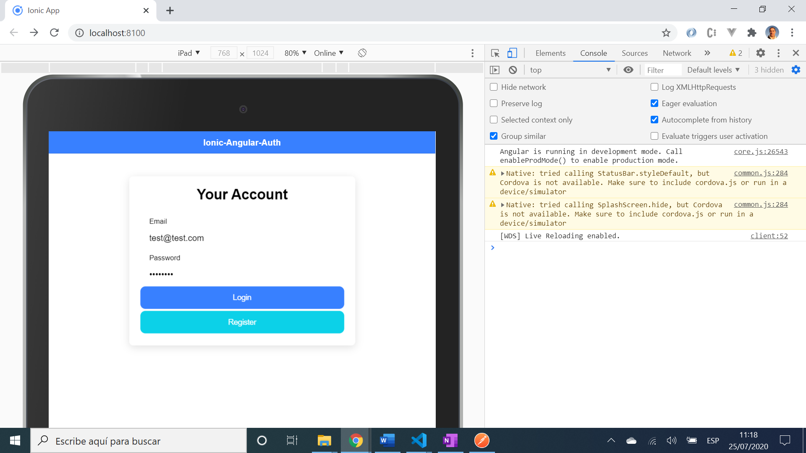

# :zap: Ionic Angular Auth

* App to prevent access to 'members' route if user not authorized. Authorization is via email & password converted to a JWT token instead of using a backend.
* Another great tutorial from [Simon Grimm of the IonicAcademy'](https://www.youtube.com/channel/UCZZPgUIorPao48a1tBYSDgg) - see [:clap: Inspiration](#clap-inspiration) below.
* **Note:** to open web links in a new window use: _ctrl+click on link_


## :page_facing_up: Table of contents

* [:zap: Ionic Angular Auth](#zap-ionic-angular-auth)
  * [:page_facing_up: Table of contents](#page_facing_up-table-of-contents)
  * [:books: General info](#books-general-info)
  * [:camera: Screenshots](#camera-screenshots)
  * [:signal_strength: Technologies](#signal_strength-technologies)
  * [:floppy_disk: Setup](#floppy_disk-setup)
  * [:computer: Code Examples from Simon Grimm of the IonicAcademy'](#computer-code-examples-from-simon-grimm-of-the-ionicacademy)
  * [:cool: Features](#cool-features)
  * [:clipboard: Status & To-do list](#clipboard-status--to-do-list)
  * [:clap: Inspiration](#clap-inspiration)
  * [:envelope: Contact](#envelope-contact)

## :books: General info

* Initial screen is a login page with email and password fields.
* Angular 'canActivate' authguard limits access to the 'members/' route to only authorised (JWT token-bearing) users.
* Example login details stored in app to test login system and avoid the need for a backend
* Correct login credentials routes user to 'member' page
* User credentials stored in Ionic storage so they can be viewed in Dev console/Application/Storage/Ionic Storage/_ionickv
* Note: the 'register' page does not actually do anything

## :camera: Screenshots



## :signal_strength: Technologies

* [Ionic v5](https://ionicframework.com/)
* [Ionic/angular v5](https://ionicframework.com/)
* [Angular v12](https://angular.io/)
* [Angular RxJS Library v6](https://angular.io/guide/rx-library) Observable functions
* [@auth0/angular-jwt v5](https://www.npmjs.com/package/@auth0/angular-jwt) provides an HttpInterceptor which automatically attaches a JSON Web Token to HttpClient requests.
* [Ionic Storage for Angular v3](https://www.npmjs.com/package/@ionic/storage-angular) key-value Storage module based on LocalForage.

## :floppy_disk: Setup

* Run `npm i` to install dependencies
* To start the server on _localhost://8100_ type: 'ionic serve'
* App uses example credentials to test system. There is no connection to an external database etc.
* To start the server on a mobile using Ionic devapp and connected via wifi, type: 'ionic serve --devapp'
* The Ionic DevApp was installed on an Android device from the Google Play app store.

## :computer: Code Examples from [Simon Grimm of the IonicAcademy'](https://www.youtube.com/channel/UCZZPgUIorPao48a1tBYSDgg)

* canActivate function uses auth service to see if user authorized.

```typescript

// uses auth.service to check if user has token in storage. Returns true if there is a token
// returns false if user does not have a token and navigates to initial login page.
canActivate(route: ActivatedRouteSnapshot): Observable<boolean> {
  return this.auth.user.pipe(
    take(1),
    map(user => {
      console.log('Can activate: ', user);
      if (!user) {
        this.alertCtrl.create({
          header: 'Unauthorized',
          message: 'You are not allowed to access that page.',
          buttons: ['OK']
        }).then(alert => alert.present());

        this.router.navigateByUrl('/');
        return false;
      } else {
        return true;
      }
    })
  );
}
```

## :cool: Features

* JWT token generated and stored using Ionic Storage - viewable in the Dev console.
* AuthGuard canActivate only true with this token. Token removed upon logging out.

## :clipboard: Status & To-do list

* Status: Working. Updated may 2021. Tested using ionic server and dummy user credentials to replace 'register' function.
* To-do: Nothing

## :clap: Inspiration

* [Simon Grimm of the IonicAcademy, Youtube video 'Building an Ionic 4 JWT Login with Tab Bar & Angular Routing'](https://www.youtube.com/watch?v=lNqXCn8KacI)
* [Written version of tutorial from Devtactic website: Building an Ionic 4 JWT Login with Tab Bar & Angular Routing](https://devdactic.com/ionic-4-jwt-login/)

## :file_folder: License

* This project is licensed under the terms of the MIT license.

## :envelope: Contact

* Repo created by [ABateman](https://github.com/AndrewJBateman), email: gomezbateman@yahoo.com
